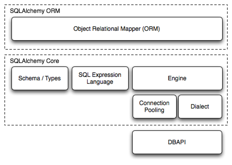

.. sqlalchemy documentation master file, created by
   sphinx-quickstart on Thu Mar 16 12:05:01 2017.
   You can adapt this file completely to your liking, but it should at least
   contain the root `toctree` directive.

Welcome to sqlalchemy's documentation!
======================================

.. toctree::
   :maxdepth: 3
   :caption: Contents:

概览
==================================

文档概述
------------------------------------

代码范例
-----------------------------------

安装指南
-----------------------------------

支持的平台
^^^^^^^^^^^^^^^^^^^^^^^^^^^^^^^^^^^^

支持的安装方式
^^^^^^^^^^^^^^^^^^^^^^^^^^^^^^^^^^^^

通过pip安装
^^^^^^^^^^^^^^^^^^^^^^^^^^^^^^^^^^^

使用setup.py安装
^^^^^^^^^^^^^^^^^^^^^^^^^^^^^^^^^^^^

安装C拓展
^^^^^^^^^^^^^^^^^^^^^^^^^^^^^^^^^^^

安装数据库API
^^^^^^^^^^^^^^^^^^^^^^^^^^^^^^^^^^^a s

检查已安装的SQLAlchemy版本
^^^^^^^^^^^^^^^^^^^^^^^^^^^^^^^^^^^

1.1到1.2的变化
----------------------------------

SQLAlchemy ORM
===================================

版本检查
----------------------------------

连接
-----------------------------------

声明映射
-----------------------------------

创建数据结构(Create a Schema)
-----------------------------------

创建一个映射类的实例
-----------------------------------

新建会话(Creating a Session)
-----------------------------------

添加和更新对象
-----------------------------------

事务回滚
-----------------------------------

查询
----------------------------------

公共过滤操作
^^^^^^^^^^^^^^^^^^^^^^^^^^^^^^^^^^

返回列表和按量返回
^^^^^^^^^^^^^^^^^^^^^^^^^^^^^^^^^^

使用SQL文本
^^^^^^^^^^^^^^^^^^^^^^^^^^^^^^^^^^

计数
^^^^^^^^^^^^^^^^^^^^^^^^^^^^^^^^^^

建立关系
----------------------------------

处理关系对象
----------------------------------

使用joins查询
----------------------------------

使用 Aliases
^^^^^^^^^^^^^^^^^^^^^^^^^^^^^^^^^^

使用子查询
^^^^^^^^^^^^^^^^^^^^^^^^^^^^^^^^^^

Selecting Entities from Subqueries
^^^^^^^^^^^^^^^^^^^^^^^^^^^^^^^^^^

使用 EXISTS
^^^^^^^^^^^^^^^^^^^^^^^^^^^^^^^^^^

公共关系操作
^^^^^^^^^^^^^^^^^^^^^^^^^^^^^^^^^^

Eager Loading
-------------

Subquery Load
^^^^^^^^^^^^^

Joined Load
^^^^^^^^^^^

Explicit Join + Eagerload
^^^^^^^^^^^^^^^^^^^^^^^^^

Deleting
--------

Configuring delete/delete-orphan Cascade
^^^^^^^^^^^^^^^^^^^^^^^^^^^^^^^^^^^^^^^^

Building a Many To Many Relationship
------------------------------------

Further Reference
-----------------

SQLAlchemy核心
===================================

Dialects
===================================

Frequently Asked Questions
==========================

Changes and Migration
=====================

Indices and tables
==================

* :ref:`genindex`
* :ref:`modindex`
* :ref:`search`
